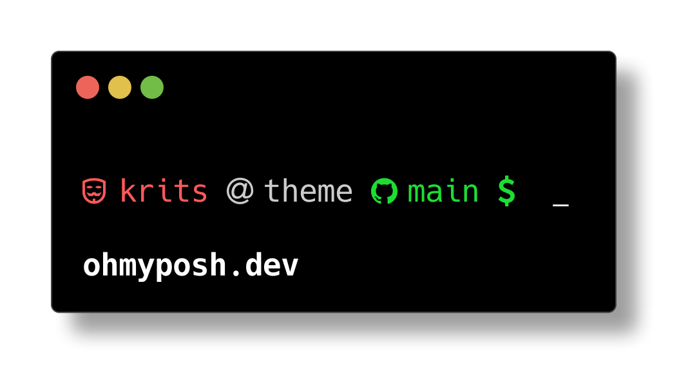

# itsmyposh-posh-theme-2024



**Font Used:** https://www.nerdfonts.com/font-downloads

## How to Use on Windows
To set up the itsmyposh-posh-theme-2024 on your Windows machine, follow these steps:

<a href="https://ohmyposh.dev/docs/installation/windows" target="_blank">Oh My Posh</a>

### Step 1: Install Oh My Posh
Install Oh My Posh using the following command:
```
winget install JanDeDobbeleer.OhMyPosh -s winget
```

### Step 2: Place the Theme File
Download the theme file (theme.omp.json) and place it in the following directory:

```
~/AppData\Local\Programs\oh-my-posh\themes\
```

### Step 3: Edit Your PowerShell Profile
Open your PowerShell profile in a text editor like Notepad or VS Code:
```
notepad $PROFILE
```
or
```
code $PROFILE
```

### Step 4: Add the Theme to Your Profile
```
oh-my-posh init pwsh --config ~/AppData\Local\Programs\oh-my-posh\themes\theme.omp.json | Invoke-Expression
Import-Module -Name Terminal-Icons
```